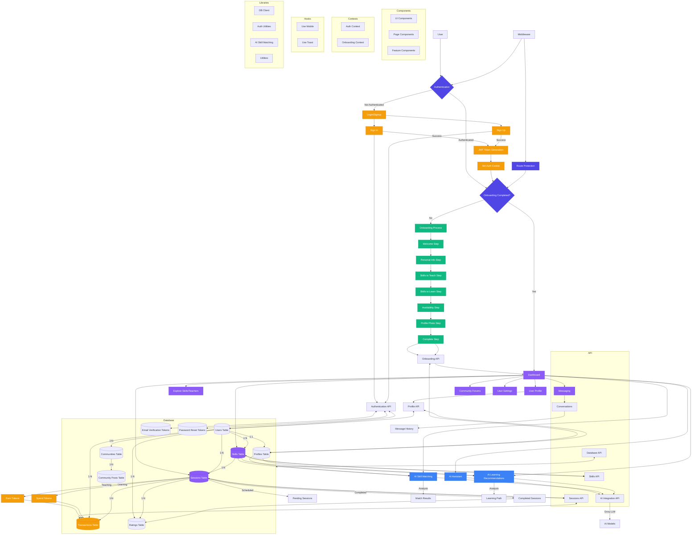

```mermaid
flowchart TD
    %% Main Application Flow
    User[User] --> Auth{Authentication}
    Auth -->|Not Authenticated| Login[Login/Signup]
    Auth -->|Authenticated| OnboardingCheck{Onboarding Completed?}
    OnboardingCheck -->|No| Onboarding[Onboarding Process]
    OnboardingCheck -->|Yes| Dashboard[Dashboard]
    
    %% Authentication Flow
    Login --> SignIn[Sign In]
    Login --> SignUp[Sign Up]
    SignIn -->|Success| JWT[JWT Token Generation]
    SignUp -->|Success| JWT
    JWT --> AuthCookie[Set Auth Cookie]
    AuthCookie --> OnboardingCheck
    
    %% Onboarding Flow
    Onboarding --> Welcome[Welcome Step]
    Welcome --> PersonalInfo[Personal Info Step]
    PersonalInfo --> TeachSkills[Skills to Teach Step]
    TeachSkills --> LearnSkills[Skills to Learn Step]
    LearnSkills --> Availability[Availability Step]
    Availability --> ProfilePhoto[Profile Photo Step]
    ProfilePhoto --> Complete[Complete Step]
    Complete --> OnboardingAPI[Onboarding API]
    OnboardingAPI --> Dashboard
    
    %% Dashboard and Main Features
    Dashboard --> Explore[Explore Skills/Teachers]
    Dashboard --> Profile[User Profile]
    Dashboard --> Sessions[Session Management]
    Dashboard --> Messages[Messaging]
    Dashboard --> Community[Community Forums]
    Dashboard --> Settings[User Settings]
    Dashboard --> Skills[Skill Management]
    
    %% AI Integration
    Dashboard --> AIAssistant[AI Assistant]
    Dashboard --> AIMatching[AI Skill Matching]
    Dashboard --> AIRecommendations[AI Learning Recommendations]
    
    %% Database Interactions
    subgraph Database
        Users[(Users Table)]
        Profiles[(Profiles Table)]
        Skills[(Skills Table)]
        Sessions[(Sessions Table)]
        Transactions[(Transactions Table)]
        Ratings[(Ratings Table)]
        Communities[(Communities Table)]
        CommunityPosts[(Community Posts Table)]
        EmailVerification[(Email Verification Tokens)]
        PasswordReset[(Password Reset Tokens)]
    end
    
    %% API Routes
    subgraph API
        AuthAPI[Authentication API]
        OnboardingAPI
        SkillsAPI[Skills API]
        SessionsAPI[Sessions API]
        ProfileAPI[Profile API]
        DBAPI[Database API]
        AIAPI[AI Integration API]
    end
    
    %% API to Database Connections
    AuthAPI <--> Users
    AuthAPI <--> EmailVerification
    AuthAPI <--> PasswordReset
    OnboardingAPI <--> Profiles
    SkillsAPI <--> Skills
    SessionsAPI <--> Sessions
    SessionsAPI <--> Transactions
    ProfileAPI <--> Profiles
    ProfileAPI <--> Users
    DBAPI <--> Database
    
    %% User Interactions with API
    SignIn --> AuthAPI
    SignUp --> AuthAPI
    Complete --> OnboardingAPI
    Skills --> SkillsAPI
    Sessions --> SessionsAPI
    Profile --> ProfileAPI
    
    %% AI Integration
    AIAssistant --> AIAPI
    AIMatching --> AIAPI
    AIRecommendations --> AIAPI
    AIAPI -->|Groq LLM| AIModels[AI Models]
    
    %% Token System
    Sessions -->|Teaching| EarnTokens[Earn Tokens]
    Sessions -->|Learning| SpendTokens[Spend Tokens]
    EarnTokens --> Transactions
    SpendTokens --> Transactions
    
    %% Middleware
    Middleware[Middleware] --> Auth
    Middleware --> RouteProtection[Route Protection]
    RouteProtection --> OnboardingCheck
    
    %% Components Structure
    subgraph Components
        UIComponents[UI Components]
        PageComponents[Page Components]
        FeatureComponents[Feature Components]
    end
    
    %% Context Providers
    subgraph Contexts
        AuthContext[Auth Context]
        OnboardingContext[Onboarding Context]
    end
    
    %% Hooks
    subgraph Hooks
        UseMobile[Use Mobile]
        UseToast[Use Toast]
    end
    
    %% Library Utilities
    subgraph Libraries
        DBClient[DB Client]
        AuthUtils[Auth Utilities]
        AISkillMatching[AI Skill Matching]
        Utils[Utilities]
    end
    
    %% Detailed Database Schema
    Users -->|1:1| Profiles
    Users -->|1:N| Skills
    Users -->|1:N| Sessions
    Users -->|1:N| Transactions
    Users -->|1:N| Ratings
    Users -->|1:N| Communities
    Skills -->|1:N| Sessions
    Sessions -->|1:N| Ratings
    Sessions -->|1:N| Transactions
    Communities -->|1:N| CommunityPosts
    
    %% Session Flow
    Sessions -->|Scheduled| PendingSessions[Pending Sessions]
    Sessions -->|Completed| CompletedSessions[Completed Sessions]
    CompletedSessions --> Ratings
    
    %% Skill Matching Process
    AIMatching -->|Analysis| MatchResults[Match Results]
    Skills --> AIMatching
    Profiles --> AIMatching
    
    %% Learning Recommendations
    AIRecommendations -->|Analysis| LearningPath[Learning Path]
    Skills --> AIRecommendations
    Profiles --> AIRecommendations
    
    %% Messaging System
    Messages --> Conversations[Conversations]
    Conversations --> MessageHistory[Message History]
    
    %% Style Definitions
    classDef primary fill:#4f46e5,stroke:#4338ca,color:white;
    classDef secondary fill:#8b5cf6,stroke:#7c3aed,color:white;
    classDef success fill:#10b981,stroke:#059669,color:white;
    classDef danger fill:#ef4444,stroke:#dc2626,color:white;
    classDef warning fill:#f59e0b,stroke:#d97706,color:white;
    classDef info fill:#3b82f6,stroke:#2563eb,color:white;
    
    %% Apply Styles
    class Auth,OnboardingCheck,RouteProtection primary;
    class Dashboard,Profile,Sessions,Messages,Community,Settings,Skills,Explore secondary;
    class AIAssistant,AIMatching,AIRecommendations info;
    class Login,SignIn,SignUp,JWT,AuthCookie warning;
    class Onboarding,Welcome,PersonalInfo,TeachSkills,LearnSkills,Availability,ProfilePhoto,Complete success;
    class EarnTokens,SpendTokens,Transactions warning;
```
